# Pipeline Architecture

<div align="center">

**English** | [中文](./architecture_zh.md)

</div>

This page explains how a declared benchmark becomes a validated job, a runtime result, a GitHub Actions artifact, and finally a row consumed by InferenceX-app. It describes boundaries and invariants. The linked implementation remains authoritative for field-level behavior.

## Page index

1. [Source map](#source-map)
2. [End-to-end flow](#end-to-end-flow)
3. [Ownership boundaries](#ownership-boundaries)
4. [Stage 1: configuration and trigger selection](#stage-1-configuration-and-trigger-selection)
5. [Stage 2: validation and matrix generation](#stage-2-validation-and-matrix-generation)
6. [Stage 3: workflow dispatch](#stage-3-workflow-dispatch)
7. [Stage 4: launcher and runtime execution](#stage-4-launcher-and-runtime-execution)
8. [Stage 5: benchmark and eval outputs](#stage-5-benchmark-and-eval-outputs)
9. [Stage 6: artifact collection and handoff](#stage-6-artifact-collection-and-handoff)
10. [Stage 7: InferenceX-app ingestion](#stage-7-inferencex-app-ingestion)
11. [Source-of-truth decisions](#source-of-truth-decisions)
12. [Non-obvious rationale](#non-obvious-rationale)
13. [Trace and verify one result](#trace-and-verify-one-result)
14. [Stop conditions](#stop-conditions)

## Source map

### InferenceX producers

| Source of truth | Responsibility |
| --- | --- |
| [`configs/CONFIGS.md`](../configs/CONFIGS.md) | Human-readable master and runner configuration contract |
| [`configs/nvidia-master.yaml`](../configs/nvidia-master.yaml), [`configs/amd-master.yaml`](../configs/amd-master.yaml) | Declarative model, image, framework, scenario, topology, and search-space intent |
| [`configs/runners.yaml`](../configs/runners.yaml) | Scheduling labels, concrete runner names, and hardware facts used during generation |
| [`perf-changelog.yaml`](../perf-changelog.yaml) | Append-only selection of config keys to run for a change |
| [`infx/matrix/validation.py`](../infx/matrix/validation.py) | Enforced Pydantic schemas and cross-field invariants |
| [`infx/matrix/generate.py`](../infx/matrix/generate.py) | Search-space expansion, defaults, filters, derived metadata, runner resolution, and eval selection |
| [`utils/process_changelog.py`](../utils/process_changelog.py) | Added-changelog extraction, config-key expansion, matrix bucketing, and final matrix validation |
| [`.github/workflows/run-sweep.yml`](../.github/workflows/run-sweep.yml) | Trigger policy, matrix fan-out, collection dependencies, and cross-repository ingest dispatch |
| [`.github/workflows/benchmark-tmpl.yml`](../.github/workflows/benchmark-tmpl.yml), [`.github/workflows/benchmark-multinode-tmpl.yml`](../.github/workflows/benchmark-multinode-tmpl.yml) | Reusable job input contract, environment projection, launcher invocation, result checks, and per-job uploads |
| [`runners/`](../runners/) | Fleet-specific model paths, mounts, container or Slurm setup, and benchmark-script routing |
| [`benchmarks/benchmark_lib.sh`](../benchmarks/benchmark_lib.sh) | Shared server readiness, benchmark client, eval, AgentX replay, and output behavior |
| [`benchmarks/`](../benchmarks/) | Framework and topology-specific server and client commands |
| [`infx/github.py`](../infx/github.py) | GitHub REST, pagination, and comment reactions shared by workflow operations |
| [`infx/workflows/`](../infx/workflows/) | Reuse command parsing, authorization lookup, source-run validation, and reaction feedback; the existing reuse CLI remains compatible |
| [`infx/results/`](../infx/results/) | Importable result builders, component metadata parsing, and power-metric transformations; [`utils/process_result.py`](../utils/process_result.py) preserves the fixed-sequence CLI |
| [`.github/workflows/collect-results.yml`](../.github/workflows/collect-results.yml), [`.github/workflows/collect-evals.yml`](../.github/workflows/collect-evals.yml) | Run-level benchmark and eval artifact aggregation |

### InferenceX-app consumers

These are cross-repository links because InferenceX-app owns the database and presentation side of the contract.

| Source of truth | Responsibility |
| --- | --- |
| [`.github/workflows/ingest-results.yml`](https://github.com/SemiAnalysisAI/InferenceX-app/blob/main/.github/workflows/ingest-results.yml) | Receives `ingest-results`, prepares artifacts, migrates, ingests, verifies, and invalidates cache |
| [`.github/workflows/ingest-agentic-results.yml`](https://github.com/SemiAnalysisAI/InferenceX-app/blob/main/.github/workflows/ingest-agentic-results.yml) | Separate long-timeout ingest path for blob-heavy AgentX artifacts |
| [`packages/db/src/prepare-ci-artifacts.ts`](https://github.com/SemiAnalysisAI/InferenceX-app/blob/main/packages/db/src/prepare-ci-artifacts.ts) | Selects and downloads source-run artifacts, including reused-sweep metadata |
| [`packages/db/src/ingest-ci-run.ts`](https://github.com/SemiAnalysisAI/InferenceX-app/blob/main/packages/db/src/ingest-ci-run.ts) | Orchestrates workflow-run, benchmark, eval, sample, trace, stats, availability, and changelog ingestion |
| [`packages/db/src/etl/benchmark-mapper.ts`](https://github.com/SemiAnalysisAI/InferenceX-app/blob/main/packages/db/src/etl/benchmark-mapper.ts) | Maps benchmark artifact rows to the database-facing canonical shape |
| [`packages/db/src/etl/eval-mapper.ts`](https://github.com/SemiAnalysisAI/InferenceX-app/blob/main/packages/db/src/etl/eval-mapper.ts) | Maps aggregate and per-config eval artifacts |
| [`packages/db/src/etl/normalizers.ts`](https://github.com/SemiAnalysisAI/InferenceX-app/blob/main/packages/db/src/etl/normalizers.ts) | Canonical model, hardware, framework, and precision resolution |
| [`packages/db/src/etl/skip-tracker.ts`](https://github.com/SemiAnalysisAI/InferenceX-app/blob/main/packages/db/src/etl/skip-tracker.ts) | Records unmapped or rejected input instead of silently losing it |
| [`packages/app/src/app/api/v1/invalidate/route.ts`](https://github.com/SemiAnalysisAI/InferenceX-app/blob/main/packages/app/src/app/api/v1/invalidate/route.ts) | Invalidates application caches after a verified ingest |
| [`packages/app/src/app/api/v1/benchmarks/route.ts`](https://github.com/SemiAnalysisAI/InferenceX-app/blob/main/packages/app/src/app/api/v1/benchmarks/route.ts) | Serves persisted benchmark rows to the dashboard |
| [InferenceX-app architecture](https://github.com/SemiAnalysisAI/InferenceX-app/blob/main/docs/architecture.md), [data pipeline](https://github.com/SemiAnalysisAI/InferenceX-app/blob/main/docs/data-pipeline.md) | Consumer-side design rationale, cache policy, ETL, and frontend transforms |

## End-to-end flow

```mermaid
flowchart LR
  A[Master YAML and runners.yaml] --> B[Pydantic validation]
  P[perf-changelog additions] --> C[process_changelog.py]
  B --> D[generate_sweep_configs.py]
  C --> D
  D --> E[Validated JSON matrix]
  E --> F[run-sweep.yml fan-out]
  F --> G[Reusable benchmark workflow]
  G --> H[Fleet launcher]
  H --> I[Benchmark script and benchmark_lib]
  I --> J[Benchmark, eval, logs, metrics, traces]
  J --> K[Per-job GitHub artifacts]
  K --> L[Run-level aggregate artifacts]
  L --> M[Repository dispatch to InferenceX-app]
  M --> N[Prepare and download artifacts]
  N --> O[Map, normalize, and upsert DB rows]
  O --> Q[Verify DB and refresh latest benchmarks]
  Q --> R[Invalidate cache]
  R --> S[Dashboard API and UI]
```



The critical handoffs are JSON-shaped contracts. Master YAML is read into validated Python models. The generator emits matrix JSON. Reusable workflows project each matrix row into typed workflow inputs and environment variables. Runtime scripts write JSON files. GitHub artifact names identify those files to the downstream TypeScript ingest.

No single file owns the whole pipeline. Correctness comes from agreement at every handoff.

## Ownership boundaries

| Layer | Owns | Does not own |
| --- | --- | --- |
| Master configuration | Desired benchmark identity, image, framework, scenarios, supported topology, and search space | Shell commands, physical mounts, artifact parsing, or database normalization |
| Validation | Accepted field names, types, and topology or scope invariants | Which changelog entry runs, scheduling priority, or runtime feature support |
| Matrix generator | Expansion into executable points, defaults, derived names and lengths, eval marking, and runner resolution | Container startup or benchmark implementation |
| Changelog processor | The changed config-key selection and grouping into workflow matrix buckets | The definition of each config or its runtime behavior |
| Sweep workflow | Trigger and label policy, canary and reuse policy, matrix fan-out, dependency gates, and ingest dispatch | Fleet-specific launch details or database mapping |
| Reusable workflow | Stable job input and environment contract, self-hosted scheduling, launcher call, file existence checks, and artifact upload names | Model path choice or framework CLI flags |
| Fleet launcher | Physical runner behavior, model staging, mounts, ports, containers, Slurm allocation, and selection of a runtime script or external recipe | Logical search-space policy or database schema |
| Benchmark and eval code | Server flags, client workload, scoring, aggregation-ready files, and runtime cleanup | Which matrix points were requested or how rows appear in the dashboard |
| Artifact collectors | Run-level packaging and stable aggregate artifact names | Semantic reinterpretation of benchmark results |
| InferenceX-app ETL | Canonicalization, idempotent persistence, skip reporting, availability, trace sidecars, and DB verification | How a serving engine was launched or which points the producer should schedule |
| InferenceX-app API and UI | Cache lifecycle, query behavior, client transforms, and presentation | Producer configuration and benchmark execution |

A field crossing a boundary is not automatically authoritative in the next layer. For example, `framework` in a master entry is authoritative producer metadata. The launcher still must route that value to a compatible script. InferenceX-app then normalizes it to its canonical database key. These are separate responsibilities, not duplicated implementations of one function.

## Stage 1: configuration and trigger selection

The master YAML files describe possible work. A config key binds the model, image, model prefix, precision, framework, runner label, scenario definitions, and one or more search-space entries. [`configs/runners.yaml`](../configs/runners.yaml) resolves scheduling labels and supplies generation-time hardware facts.

A master entry is inert until selected. On the main sweep path, additions to [`perf-changelog.yaml`](../perf-changelog.yaml) select exact config keys or key patterns. [`utils/process_changelog.py`](../utils/process_changelog.py) reads only added changelog lines between the base and head references. It validates each added entry, expands key patterns against the loaded master configs, and invokes the matrix generator for the selected keys.

This split has two consequences.

1. The master files are the catalog of supported work. The changelog is the audit trail and trigger selection, not another copy of config contents.
2. Editing a master entry without a matching changelog addition does not schedule that change through `run-sweep.yml`, whose path trigger watches `perf-changelog.yaml`.

`process_changelog.py` preserves changelog metadata in the emitted JSON. The workflow later uploads it as `changelog-metadata`, allowing InferenceX-app to associate persisted rows with the selected change.

## Stage 2: validation and matrix generation

Shared Python implementation lives in the repository-root `infx` package. `infx.matrix.generate` owns generation and `infx.matrix.validation` owns schemas. Python callers should import these canonical paths; further domain modules can join `infx` as needed.

`utils/matrix_logic/generate_sweep_configs.py` and `validation.py` remain thin compatibility entrypoints. Legacy imports resolve to the same module objects, avoiding duplicate schema classes. Existing script commands, arguments, relative input paths, and dependencies are unchanged; running from a checkout requires no package installation. `process_changelog.py` and `validate_perf_changelog.py` import the `infx.matrix` modules directly.

For append-only historical comparisons, `generation_inputs_at_ref` extracts configs, legacy entrypoints, and the `infx` package (when present) from the same Git revision. Revisions before this migration continue to run their standalone generator; newer revisions use their own package code. Working-tree source and configs do not replace historical inputs.

[`validation.py`](../infx/matrix/validation.py) validates master files and runner data before generation. Its strict models own accepted aliases and cross-field rules. Examples include mutually exclusive concurrency forms, single-node versus multi-node shapes, component metadata scope, prefill and decode hardware pairing, and cluster-label requirements for agentic scenarios.

[`infx.matrix.generate`](../infx/matrix/generate.py) then expands validated intent into rows. It owns decisions such as:

- concrete concurrency points from ranges or lists.
- default parallelism values.
- derived experiment names and sequence-length fields.
- single-node and multi-node worker shapes.
- agentic duration and KV-offload metadata.
- runner-node filtering and hardware-derived values.
- the normal eval subset, `--all-evals`, `--evals-only`, and `--no-evals` behavior.

`process_changelog.py` places generated rows into distinct JSON buckets. Current buckets are `single_node` by sequence family, `multi_node` by sequence family, `evals`, `agentic_evals`, `multinode_evals`, and `changelog_metadata`. It validates that final object with `ChangelogMatrixEntry` before printing it.

The emitted matrix is the executable CI contract, but it is not a durable source to edit. Change the upstream master config, validator, or generator and regenerate it.

## Stage 3: workflow dispatch

[`.github/workflows/run-sweep.yml`](../.github/workflows/run-sweep.yml) is the orchestration boundary.

1. It triggers on `perf-changelog.yaml` changes to `main` and eligible pull-request events.
2. It validates changelog additions and applies PR label policy.
3. Its setup job runs `process_changelog.py`, then applies CI priority metadata with [`utils/ci_priority.py`](../utils/ci_priority.py).
4. It exposes the entire matrix as the `search-space-config` job output.
5. Matrix jobs consume the appropriate bucket and call either `benchmark-tmpl.yml` or `benchmark-multinode-tmpl.yml`.
6. Benchmark, eval, and agentic rows use separate fan-out jobs because their required input shapes differ.
7. Collection waits on the relevant jobs. Main-branch runs dispatch ingestion only after required collection and changelog-metadata work reaches an allowed state.

The reusable workflows form an explicit adapter between matrix keys and runtime environment variables. For example, matrix `model-prefix`, `dcp-size`, `spec-decoding`, and `run-eval` become `MODEL_PREFIX`, `DCP_SIZE`, `SPEC_DECODING`, and `RUN_EVAL`. This projection is load-bearing. A new master field has no runtime effect until the generator emits it, the calling workflow forwards it, the template exposes it, and runtime code consumes it.

The matrix `runner` value also drives `runs-on`. Once a self-hosted runner is assigned, the template obtains its concrete `${{ runner.name }}` and launches:

```bash
bash ./runners/launch_${RUNNER_NAME%%_*}.sh
```

The prefix before the first underscore therefore identifies the fleet launcher. Runner naming and launcher filenames are one routing contract.

`infx.github` owns the shared REST, pagination, and comment-reaction primitives. `infx.workflows.reuse` owns reuse selection and validation, while `infx.workflows.reuse_comment` owns comment reaction feedback. Both are executable package modules. `utils/find_reusable_sweep_run.py` preserves direct script execution and legacy imports, which resolve to the same canonical module. These helpers use only the standard library.

## Stage 4: launcher and runtime execution

A launcher under [`runners/`](../runners/) adapts logical job metadata to one physical fleet. Depending on the fleet and topology, it may:

- resolve a portable model ID to a staged local path.
- choose a collision-free port.
- prepare host mounts and caches.
- pull or import a container image.
- allocate Slurm nodes and build framework-specific configuration.
- choose a single-node script, a multi-node wrapper, or a checked-in external recipe.
- pass the workflow environment into the runtime container or allocation.

Benchmark scripts under [`benchmarks/`](../benchmarks/) own the actual engine and client commands. Most source [`benchmarks/benchmark_lib.sh`](../benchmarks/benchmark_lib.sh), which centralizes server readiness, the serving benchmark client, GPU monitoring, lm-eval, SWE-bench, AgentX replay, and stable output helpers.

The boundary is intentional. A master config remains portable and reviewable. Machine paths, scheduler details, and container mechanics stay close to the fleet that requires them. Framework flags stay close to the benchmark recipe where they can be tested against that engine.

Do not use YAML acceptance as proof of execution. A field can be valid and emitted yet still be ignored because a workflow adapter, launcher, or benchmark script does not consume it.

## Stage 5: benchmark and eval outputs

The single-node template computes a stable `RESULT_FILENAME` from experiment identity, precision, framework, topology, disaggregation, speculative decoding, concurrency, and concrete runner. The launcher and benchmark code must write the expected file under that identity.

For fixed-sequence throughput jobs, the workflow requires `<RESULT_FILENAME>.json`, then runs [`utils/process_result.py`](../utils/process_result.py) and uploads `agg_<RESULT_FILENAME>.json` as `bmk_<RESULT_FILENAME>`.

### Reusing and extending result processing

[`infx.results.fixed_sequence.build_result`](../infx/results/fixed_sequence.py) accepts a loaded benchmark mapping and an explicit environment mapping. It returns the aggregate dictionary without reading process environment or performing file I/O. Library callers do not need `RESULT_FILENAME`. The existing CLI validates its environment, reads the raw artifact, calls the builder, writes the aggregate, and runs power aggregation with the existing best-effort or `REQUIRE_POWER` policy.

```python
from infx.results.fixed_sequence import build_result

result = build_result(raw_benchmark, runtime_env)
```

New formats should expose their own typed builder under `infx/results/`, accepting the inputs that format needs and returning a dictionary. Compose shared transformations as ordinary function calls; keep file discovery, environment defaults, error presentation, and serialization in the format's CLI adapter. Existing AgentX topology and request/server processing retain their own policies.

[`infx.results.agentic.build_result`](../infx/results/agentic/__init__.py) owns AgentX aggregate construction, including request metrics, backend selection, server metrics, and per-GPU throughput. It accepts loaded AIPerf records, profile and server-metric mappings, and an explicit environment mapping. Optional `traces` are raw trace objects from the declared dataset; optional `server_logs` contain one decoded file head per item. The builder does not open files or read process environment. It returns unrounded metrics and does not mutate inputs; dataset and request-accounting mappings remain shared with the result.

```python
from infx.results.agentic import build_result

result = build_result(records, profile, server_metrics, runtime_env,
                      traces=trace_objects, server_logs=log_texts)
```

The existing `python -m utils.agentic.aggregation.process_agentic_result` command retains artifact discovery, record filtering/accounting, trace-cache lookup, bounded log reads, rounding, diagnostics, and output writes. It supplies lazy trace and log iterators so metadata validation still precedes trace reads and backends only read logs they use. Request/server algorithms and backend precedence remain inside the package. Dataset matching, cache precedence, and ambiguous-snapshot handling remain in the CLI's shared artifact loader, which also serves the power adapter. Internal Python imports use `infx.results.agentic`; command paths, environment variables, and artifact schemas are unchanged.

The current processing paths share these helpers:

- [`parse_component_metadata`](../infx/results/metadata.py) accepts a raw JSON value and diagnostic label. Callers select whether `version` is optional and whether invalid input raises `ValueError` or `SystemExit`, preserving their existing contracts.
- [`Parallelism`](../infx/results/topology.py) shares GPU-count calculation, parallelism result fields, and normalization when there are no separate decode GPUs. Fixed-sequence results retain explicit allocation counts; AgentX derives counts from its workers. Each caller retains its environment defaults, validation order, errors, and throughput denominators.
- [`with_power_metrics`](../infx/results/power/__init__.py) returns a copy with the supplied metric family replaced, removes stale validity reasons, and validates and rounds new metrics. Callers supply metric keys and schema version, then own artifact writes and validation sidecars. This allows another metric family to reuse the transformation without changing its implementation.

Power telemetry engines also live in [`infx.results.power`](../infx/results/power/): `single_node.run` consumes GPU-monitor CSVs, while `multinode.run` validates srt-slurm artifact packages. They share benchmark-window parsing, per-device integration, aggregate replacement, and audit serialization through `common.py`, while retaining their own telemetry validation and failure policies. Fixed-sequence and AgentX adapters import these engines directly; new result formats can supply their benchmark window and token counts to the matching engine.

The existing `utils/aggregate_power.py` and `utils/aggregate_power_multinode.py` commands remain compatibility entrypoints, including direct execution outside the checkout. Legacy imports resolve to the canonical engine modules, so both paths refer to the same classes and functions. The `infx` package runs independently of these wrappers, with no installation step or new runtime dependency. The engines are also callable with `python -m infx.results.power.single_node` and `python -m infx.results.power.multinode` from the repository root.

Test builders with small, independently worked examples and read-only inputs. For changes to an existing adapter, also compare CLI status, diagnostics, and generated artifacts with the previous implementation, including invalid inputs and strict/best-effort power failures.

### Eval and AgentX outputs

For eval-only jobs, throughput output is not required. The workflow instead requires at least one `results*.json`. For jobs marked to run eval, uploads may contain `meta_env.json`, `results*.json`, `sample*.jsonl`, SWE-bench predictions and reports, and trajectory files. [`utils/evals/validate_scores.py`](../utils/evals/validate_scores.py) checks produced eval scores.

[`infx.results.evals`](../infx/results/evals.py) provides `extract_metrics` for loaded eval JSON and `build_rows` for collector output. Both accept explicit inputs without file I/O or input mutation. The builder applies metadata defaults and primary-score precedence, retaining failed evaluations as diagnostic rows. The CLI owns file discovery, concurrency selection, reporting, and artifact writes.

```python
from infx.results.evals import build_rows

rows = build_rows(raw_eval, metadata, source="eval_job/results.json")
```

The collector and reusable-artifact validator share format recognition, concurrency suffix parsing, result ordering, metric-family classification, and numeric validity rules. Filename timestamps and legacy mtimes use epoch nanoseconds, with filenames breaking ties. Reuse retains its stricter structural checks and checks every applicable primary metric; the collector keeps the last configured value per metric family for reporting. Recognizing a format does not imply that its results are valid or reusable.

Agentic throughput jobs have a different contract. They validate AIPerf output with [`utils/agentic/validation/validate_agentic_result.py`](../utils/agentic/validation/validate_agentic_result.py), upload an aggregate `bmk_agentic_<suffix>` artifact, and upload the raw `agentic_<suffix>` sibling containing trace-replay material. InferenceX-app pairs those siblings by their shared suffix. Agentic eval-only jobs follow the eval output contract instead and do not require a throughput result.

Server logs and GPU metrics are diagnostic side artifacts. They are uploaded with `always()` so a failed run can still be investigated. Their presence does not turn a failed benchmark into a valid result.

## Stage 6: artifact collection and handoff

Per-job artifacts remain useful for diagnosis and detailed ingestion. Two collectors also create stable run-level aggregates.

- [`collect-results.yml`](../.github/workflows/collect-results.yml) downloads `bmk_*`, runs [`utils/collect_results.py`](../utils/collect_results.py), and uploads `results_bmk/agg_bmk.json`.
- [`collect-evals.yml`](../.github/workflows/collect-evals.yml) downloads `eval_*`, runs [`utils/collect_eval_results.py`](../utils/collect_eval_results.py), and uploads `eval_results_all/agg_eval_all.json`.
- `run-sweep.yml` separately uploads `changelog-metadata/changelog_metadata.json` and `run-stats/run_stats.json` when applicable.

Artifact names are part of the cross-repository interface. InferenceX-app's `ingest-ci-run.ts` names `results_bmk`, `run-stats`, `eval_results_all`, and `changelog-metadata` explicitly. It also discovers per-job `bmk_*`, `eval_*`, logs, and agentic sibling directories.

On a qualifying push to `main`, `run-sweep.yml` sends a GitHub `repository_dispatch` to `SemiAnalysisAI/InferenceX-app`.

- Normal benchmark and eval runs use `event_type: ingest-results`.
- Agentic trace runs use `event_type: ingest-agentic-results` and a separate workflow with a longer timeout.
- The payload carries `source-run-id` and `merge-run-id`. A reused PR sweep can supply artifacts from the source run while the merge run supplies current changelog context.

A successful benchmark artifact upload is not the same as a successful ingest. The repository dispatch, artifact preparation, ETL, database verification, and cache invalidation are later boundaries.

## Stage 7: InferenceX-app ingestion

The receiving workflow first runs [`prepare-ci-artifacts.ts`](https://github.com/SemiAnalysisAI/InferenceX-app/blob/main/packages/db/src/prepare-ci-artifacts.ts). It validates numeric run IDs, fetches source and merge run metadata, lists artifacts, builds a selection plan, downloads into an empty directory, and writes reuse metadata when source and merge runs differ.

After migrations, [`ingest-ci-run.ts`](https://github.com/SemiAnalysisAI/InferenceX-app/blob/main/packages/db/src/ingest-ci-run.ts) performs the semantic handoff.

1. It loads workflow metadata and creates or reuses the workflow-run row.
2. It preloads the config cache to avoid per-row config lookup overhead.
3. It reads benchmark aggregates plus per-job artifacts, maps them through `benchmark-mapper.ts`, and upserts benchmark rows, availability, server logs, stats, and agentic trace sidecars.
4. It reads `eval_results_all/agg_eval_all.json` for aggregate eval rows.
5. It reads each per-config `eval_*` directory for metadata, task results, and sample JSONL, then attaches samples to canonical eval rows.
6. It ingests changelog metadata and preserves reused-run attribution.
7. It records unmapped models, hardware, precisions, and missing datasets for operator notification rather than silently treating them as valid.
8. It refreshes `latest_benchmarks` after ingestion.

The workflow then applies durable run overrides, runs database verification, and calls the app's invalidation endpoint. Only after persistence and cache invalidation can the dashboard API reliably expose the new state.

The ingest is deliberately idempotent. Natural-key conflicts update or preserve existing rows, so rerunning a partial or repeated ingest does not require deleting the database state first. See the [InferenceX-app data-pipeline rationale](https://github.com/SemiAnalysisAI/InferenceX-app/blob/main/docs/data-pipeline.md#why-idempotent-ingestion).

## Source-of-truth decisions

### Configuration intent lives in master YAML

Use the master entry to answer what should be benchmarked. Use runner config for where it may be scheduled. Use the benchmark script and launcher to answer how it executes. Do not encode physical host details into master YAML merely because they affect one fleet.

### Validation behavior lives in code

`configs/CONFIGS.md` explains the contract, but `validation.py` decides what is accepted. When prose and enforcement differ, fix them together. Do not bypass validation by adding ad hoc workflow parsing.

### Matrix derivation has one implementation

Derived concurrency points, eval selection, topology defaults, names, and runner-derived facts belong in `infx.matrix.generate`. Workflows should forward matrix fields, not reimplement generator policy in expressions or shell.

The `full-sweep` and `test-config` commands share fixed-sequence and AgentX row builders. Command-specific selection remains in the callers; the AgentX builder owns worker defaults, offload budgets, experiment names, node counts, and validation. It validates topology and offload budgets before filtering concurrency, preserves point and runner ordering, and filters AgentX bounds without inventing a capped concurrency point.

### Trigger selection is separate from configuration

`perf-changelog.yaml` selects work and records why. It does not redefine a master entry. This makes the configuration catalog reusable while keeping a reviewable history of what each sweep intended to run.

### Launch mechanics stay fleet-local

Model mounts, Slurm partitions, squash caches, and physical ports belong in `runners/launch_*.sh`. Framework server and client flags belong in benchmark scripts or external recipes. This avoids one universal launcher filled with unrelated fleet branches.

### Artifact JSON is the repository boundary

InferenceX owns producing correctly identified artifacts. InferenceX-app owns interpreting those artifacts into canonical database records. Never make InferenceX-app scrape workflow logs to recover fields that should have been emitted in JSON.

### The app database is the public data source

GitHub artifacts are transport and recovery inputs. They are not the live dashboard database. InferenceX-app owns normalization, idempotent persistence, read models, cache invalidation, and presentation transforms.

## Non-obvious rationale

### Why validate before expansion

Expansion multiplies one declaration into many jobs. Rejecting an invalid topology before fan-out prevents repeated GPU failures and produces one actionable configuration error.

### Why keep the generated matrix ephemeral

Checking generated rows into source would create two editable truths. Regeneration from master YAML makes defaults and policy changes deterministic and keeps review focused on intent plus generator behavior.

### Why split single-node, multi-node, eval, and agentic buckets

The shapes differ. Multi-node rows carry prefill and decode workers. Fixed-sequence rows carry ISL, OSL, and maximum model length. Agentic rows carry duration and offload inputs. Separate buckets let reusable workflow interfaces stay strict instead of accepting one mostly optional object.

### Why launch from the concrete runner name

The scheduling label selects a compatible pool, but the assigned runner identifies the physical fleet instance. The stable prefix routes to the correct fleet adapter while the full name remains available for collision avoidance and result provenance.

### Why aggregate and retain per-job artifacts

Run-level aggregates make common ingestion cheap. Per-job eval samples, logs, metrics, and traces carry details that cannot be represented in one compact file. Keeping both avoids forcing every consumer to download all diagnostics while preserving drill-down and recovery.

### Why artifact names are strict

GitHub Actions artifacts do not provide a richer typed schema. Stable names act as routing keys for collectors and ETL. Renaming `results_bmk` or `eval_results_all` without updating InferenceX-app can yield a successful producer run with missing database rows.

### Why agentic ingestion is separate

AgentX trace exports are much larger and require trace discovery, timeline processing, dataset linkage, and sidecar persistence. A separate long-timeout workflow prevents those costs from weakening the normal fixed-sequence ingest path.

### Why ingestion normalizes again

Producer validation proves the job shape, not the long-term database vocabulary. The app also ingests historical and recovered artifacts. Its normalizers absorb known aliases and report unknown entities so database keys remain stable across producer evolution.

### Why cache invalidation follows database verification

Invalidating before a verified write can expose partial data and then cache it. The receiving workflow migrates, ingests, applies overrides, verifies, and only then invalidates the application cache.

### Why source and merge run IDs are distinct

A merge can reuse an authorized PR sweep instead of rerunning expensive GPU work. The source run identifies the actual benchmark artifacts and provenance. The merge run contributes the current trigger and changelog context. Keeping both avoids attributing old artifacts to the wrong execution or losing the merge audit trail.

## Trace and verify one result

Use this procedure when a row is missing, mislabeled, or unexpected.

1. **Config:** Find the exact key in `configs/nvidia-master.yaml` or `configs/amd-master.yaml`. Record `model-prefix`, `framework`, `precision`, runner, scenario, topology, and concurrency.
2. **Selection:** Confirm the added `perf-changelog.yaml` entry selects that key and scenario. If it was a PR, check sweep labels and skip or reuse policy in `run-sweep.yml`.
3. **Validation:** Generate only the exact key and inspect the JSON, not just the exit code.

   ```bash
   uv run --no-project --exclude-newer PT12H --python 3.12 --with pydantic --with pyyaml \
     utils/matrix_logic/generate_sweep_configs.py test-config \
     --config-files configs/nvidia-master.yaml configs/amd-master.yaml \
     --runner-config configs/runners.yaml \
     --config-keys <exact-key>
   ```

4. **Matrix handoff:** In the `setup` job, verify the row is in the expected `single_node`, `multi_node`, `evals`, `agentic_evals`, or `multinode_evals` bucket. Confirm every required field is forwarded by the matching fan-out job.
5. **Scheduling:** Verify the template's `runs-on` value matches the intended runner. Confirm the concrete runner name prefix resolves to an existing `runners/launch_<prefix>.sh`.
6. **Runtime:** Trace the launcher branch to the exact benchmark script or external recipe. Confirm every critical matrix field reaches a consumed environment variable or command argument.
7. **Output:** Verify the workflow's required raw result exists. Then verify the expected `bmk_*`, `eval_*`, `agentic_*`, logs, or metrics artifact was uploaded.
8. **Collection:** For fixed-sequence throughput, inspect `results_bmk/agg_bmk.json`. For eval, inspect `eval_results_all/agg_eval_all.json` and the per-config eval artifact. Also confirm `changelog-metadata` exists.
9. **Dispatch:** On a main-branch run, verify the correct repository-dispatch job ran and its `source-run-id` and `merge-run-id` identify the intended runs.
10. **Ingest:** In InferenceX-app, verify artifact preparation selected the expected names, ETL reported mapped rows rather than skips, database verification passed, and cache invalidation was attempted.
11. **Consumer:** Query the dashboard only after ingest completion. If the row is absent, use the ETL skip and unmapped-entity output before changing frontend code.

For a matrix-only check, stop after step 4. For an end-to-end production claim, all eleven steps are required.

## Stop conditions

Do not launch or approve a sweep when any of these conditions holds.

- The master key does not pass strict validation or targeted generation.
- Generated topology, concurrency, eval marking, image, or runner differs from the intended declaration.
- A required field disappears between matrix JSON, reusable-workflow input, environment, launcher, and runtime command.
- The concrete runner prefix has no matching launcher, or the launcher has no compatible branch for the model, precision, framework, and topology.
- The benchmark or eval path cannot state its expected result filename and artifact name.
- Producer artifact names no longer match the names consumed by InferenceX-app.
- A main-branch run reaches dispatch before required collection or changelog metadata is ready.
- Ingest reports an unmapped model, hardware, precision, or required dataset for the row under investigation.
- Database verification fails, or the latest-benchmark refresh does not complete.
- A dashboard claim is based only on successful benchmark jobs without evidence of successful ingest and cache invalidation.

The pipeline is complete only when the declared config, generated matrix, scheduled job, runtime command, artifact identity, canonical database row, and dashboard view describe the same benchmark point.
