# 流水线架构

<div align="center">

[English](./architecture.md) | **中文**

</div>

本页说明声明的基准测试如何转化为经过验证的作业、运行时结果、GitHub Actions 工件，并最终成为 InferenceX-app 使用的一行数据。本页描述各层边界和不变量。字段级行为仍以链接的实现为准。

## 页面索引

1. [源码映射](#源码映射)
2. [端到端流程](#端到端流程)
3. [归属边界](#归属边界)
4. [阶段 1：配置与触发选择](#阶段-1配置与触发选择)
5. [阶段 2：验证与矩阵生成](#阶段-2验证与矩阵生成)
6. [阶段 3：工作流分派](#阶段-3工作流分派)
7. [阶段 4：启动器与运行时执行](#阶段-4启动器与运行时执行)
8. [阶段 5：基准测试与评测输出](#阶段-5基准测试与评测输出)
9. [阶段 6：工件收集与交接](#阶段-6工件收集与交接)
10. [阶段 7：InferenceX-app 摄取](#阶段-7inferencex-app-摄取)
11. [权威来源决策](#权威来源决策)
12. [不明显的设计理由](#不明显的设计理由)
13. [追踪并验证一项结果](#追踪并验证一项结果)
14. [停止条件](#停止条件)

## 源码映射

### InferenceX 生产方

| 权威来源 | 职责 |
| --- | --- |
| [`configs/CONFIGS.md`](../configs/CONFIGS.md) | 面向人员的主配置和运行器配置契约 |
| [`configs/nvidia-master.yaml`](../configs/nvidia-master.yaml)、[`configs/amd-master.yaml`](../configs/amd-master.yaml) | 声明式的模型、镜像、框架、场景、拓扑和搜索空间意图 |
| [`configs/runners.yaml`](../configs/runners.yaml) | 生成期间使用的调度标签、具体运行器名称和硬件信息 |
| [`perf-changelog.yaml`](../perf-changelog.yaml) | 以仅追加方式选择要针对某项变更运行的配置键 |
| [`infx/matrix/validation.py`](../infx/matrix/validation.py) | 强制执行的 Pydantic 模式和跨字段不变量 |
| [`infx/matrix/generate.py`](../infx/matrix/generate.py) | 搜索空间展开、默认值、过滤器、派生元数据、运行器解析和评测选择 |
| [`utils/process_changelog.py`](../utils/process_changelog.py) | 新增变更日志提取、配置键展开、矩阵分桶和最终矩阵验证 |
| [`.github/workflows/run-sweep.yml`](../.github/workflows/run-sweep.yml) | 触发策略、矩阵扇出、收集依赖和跨仓库摄取分派 |
| [`.github/workflows/benchmark-tmpl.yml`](../.github/workflows/benchmark-tmpl.yml)、[`.github/workflows/benchmark-multinode-tmpl.yml`](../.github/workflows/benchmark-multinode-tmpl.yml) | 可复用作业输入契约、环境映射、启动器调用、结果检查和单作业上传 |
| [`runners/`](../runners/) | 特定机群的模型路径、挂载、容器或 Slurm 设置以及基准测试脚本路由 |
| [`benchmarks/benchmark_lib.sh`](../benchmarks/benchmark_lib.sh) | 共享的服务器就绪检查、基准测试客户端、评测、AgentX 重放和输出行为 |
| [`benchmarks/`](../benchmarks/) | 特定于框架和拓扑的服务器与客户端命令 |
| [`infx/results/`](../infx/results/) | 可导入的结果构建函数、组件元数据解析和功耗指标转换；[`utils/process_result.py`](../utils/process_result.py) 保留固定序列处理的 CLI |
| [`.github/workflows/collect-results.yml`](../.github/workflows/collect-results.yml)、[`.github/workflows/collect-evals.yml`](../.github/workflows/collect-evals.yml) | 运行级基准测试和评测工件聚合 |

### InferenceX-app 使用方

这些是跨仓库链接，因为数据库和展示侧契约由 InferenceX-app 负责。

| 权威来源 | 职责 |
| --- | --- |
| [`.github/workflows/ingest-results.yml`](https://github.com/SemiAnalysisAI/InferenceX-app/blob/main/.github/workflows/ingest-results.yml) | 接收 `ingest-results`，准备工件、执行迁移、摄取、验证并使缓存失效 |
| [`.github/workflows/ingest-agentic-results.yml`](https://github.com/SemiAnalysisAI/InferenceX-app/blob/main/.github/workflows/ingest-agentic-results.yml) | 面向包含大量 blob 的 AgentX 工件的独立长超时摄取路径 |
| [`packages/db/src/prepare-ci-artifacts.ts`](https://github.com/SemiAnalysisAI/InferenceX-app/blob/main/packages/db/src/prepare-ci-artifacts.ts) | 选择并下载源运行工件，包括复用扫描元数据 |
| [`packages/db/src/ingest-ci-run.ts`](https://github.com/SemiAnalysisAI/InferenceX-app/blob/main/packages/db/src/ingest-ci-run.ts) | 编排工作流运行、基准测试、评测、样本、追踪、统计、可用性和变更日志的摄取 |
| [`packages/db/src/etl/benchmark-mapper.ts`](https://github.com/SemiAnalysisAI/InferenceX-app/blob/main/packages/db/src/etl/benchmark-mapper.ts) | 将基准测试工件行映射为面向数据库的规范形态 |
| [`packages/db/src/etl/eval-mapper.ts`](https://github.com/SemiAnalysisAI/InferenceX-app/blob/main/packages/db/src/etl/eval-mapper.ts) | 映射聚合评测工件和按配置划分的评测工件 |
| [`packages/db/src/etl/normalizers.ts`](https://github.com/SemiAnalysisAI/InferenceX-app/blob/main/packages/db/src/etl/normalizers.ts) | 解析规范模型、硬件、框架和精度 |
| [`packages/db/src/etl/skip-tracker.ts`](https://github.com/SemiAnalysisAI/InferenceX-app/blob/main/packages/db/src/etl/skip-tracker.ts) | 记录未映射或被拒绝的输入，避免静默丢失 |
| [`packages/app/src/app/api/v1/invalidate/route.ts`](https://github.com/SemiAnalysisAI/InferenceX-app/blob/main/packages/app/src/app/api/v1/invalidate/route.ts) | 在摄取通过验证后使应用缓存失效 |
| [`packages/app/src/app/api/v1/benchmarks/route.ts`](https://github.com/SemiAnalysisAI/InferenceX-app/blob/main/packages/app/src/app/api/v1/benchmarks/route.ts) | 向仪表板提供持久化的基准测试行 |
| [InferenceX-app 架构](https://github.com/SemiAnalysisAI/InferenceX-app/blob/main/docs/architecture.md)、[数据流水线](https://github.com/SemiAnalysisAI/InferenceX-app/blob/main/docs/data-pipeline.md) | 使用方的设计理由、缓存策略、ETL 和前端转换 |

## 端到端流程

```mermaid
flowchart LR
  A[主 YAML 和 runners.yaml] --> B[Pydantic 验证]
  P[perf-changelog 新增项] --> C[process_changelog.py]
  B --> D[generate_sweep_configs.py]
  C --> D
  D --> E[经过验证的 JSON 矩阵]
  E --> F[run-sweep.yml 扇出]
  F --> G[可复用基准测试工作流]
  G --> H[机群启动器]
  H --> I[基准测试脚本和 benchmark_lib]
  I --> J[基准测试、评测、日志、指标、追踪]
  J --> K[单作业 GitHub 工件]
  K --> L[运行级聚合工件]
  L --> M[向 InferenceX-app 进行仓库分派]
  M --> N[准备并下载工件]
  N --> O[映射、规范化并向上插入数据库行]
  O --> Q[验证数据库并刷新最新基准测试]
  Q --> R[使缓存失效]
  R --> S[仪表板 API 和 UI]
```



关键交接点是具有 JSON 形态的契约。主 YAML 被读取到经过验证的 Python 模型中。生成器发出矩阵 JSON。可复用工作流将每一行矩阵映射为有类型的工作流输入和环境变量。运行时脚本写入 JSON 文件。GitHub 工件名称向下游 TypeScript 摄取过程标识这些文件。

没有任何单个文件负责整条流水线。正确性来自每个交接点上的一致性。

## 归属边界

| 层 | 负责 | 不负责 |
| --- | --- | --- |
| 主配置 | 所需的基准测试标识、镜像、框架、场景、支持的拓扑和搜索空间 | Shell 命令、物理挂载、工件解析或数据库规范化 |
| 验证 | 接受的字段名称、类型以及拓扑或作用域不变量 | 运行哪个变更日志条目、调度优先级或运行时功能支持 |
| 矩阵生成器 | 展开为可执行点、默认值、派生名称和长度、评测标记以及运行器解析 | 容器启动或基准测试实现 |
| 变更日志处理器 | 选择发生变更的配置键，并将其分组到工作流矩阵桶中 | 每项配置的定义或其运行时行为 |
| 扫描工作流 | 触发和标签策略、金丝雀与复用策略、矩阵扇出、依赖门控和摄取分派 | 特定于机群的启动细节或数据库映射 |
| 可复用工作流 | 稳定的作业输入和环境契约、自托管调度、启动器调用、文件存在性检查和工件上传名称 | 模型路径选择或框架 CLI 标志 |
| 机群启动器 | 物理运行器行为、模型暂存、挂载、端口、容器、Slurm 分配，以及选择运行时脚本或外部方案 | 逻辑搜索空间策略或数据库模式 |
| 基准测试和评测代码 | 服务器标志、客户端负载、评分、可供聚合的文件和运行时清理 | 请求了哪些矩阵点或数据行如何在仪表板中显示 |
| 工件收集器 | 运行级打包和稳定的聚合工件名称 | 对基准测试结果进行语义重解释 |
| InferenceX-app ETL | 规范化、幂等持久化、跳过报告、可用性、追踪旁路文件和数据库验证 | 服务引擎如何启动或生产方应调度哪些点 |
| InferenceX-app API 和 UI | 缓存生命周期、查询行为、客户端转换和展示 | 生产方配置和基准测试执行 |

跨越边界的字段不会自动在下一层中成为权威来源。例如，主条目中的 `framework` 是权威的生产方元数据。启动器仍然必须将该值路由到兼容的脚本。随后，InferenceX-app 会将其规范化为数据库中的规范键。这些是不同的职责，而不是同一功能的重复实现。

## 阶段 1：配置与触发选择

主 YAML 文件描述可能执行的工作。配置键将模型、镜像、模型前缀、精度、框架、运行器标签、场景定义以及一个或多个搜索空间条目绑定在一起。[`configs/runners.yaml`](../configs/runners.yaml) 解析调度标签，并提供生成时使用的硬件信息。

主条目在被选中之前不会生效。在主扫描路径上，[`perf-changelog.yaml`](../perf-changelog.yaml) 的新增内容会选择确切的配置键或键模式。[`utils/process_changelog.py`](../utils/process_changelog.py) 仅读取基础引用与头部引用之间新增的变更日志行。它会验证每个新增条目，针对已加载的主配置展开键模式，并为选中的键调用矩阵生成器。

这种拆分有两个结果。

1. 主文件是受支持工作的目录。变更日志是审计记录和触发选择，而不是配置内容的另一个副本。
2. 如果编辑主条目时没有添加匹配的变更日志条目，则不会通过 `run-sweep.yml` 调度该变更，因为其路径触发器监视的是 `perf-changelog.yaml`。

`process_changelog.py` 会在发出的 JSON 中保留变更日志元数据。工作流随后将其作为 `changelog-metadata` 上传，使 InferenceX-app 能够将持久化的数据行与所选变更关联起来。

## 阶段 2：验证与矩阵生成

共享 Python 实现位于仓库根目录的 `infx` 包中。`infx.matrix.generate` 负责矩阵生成，`infx.matrix.validation` 负责模式校验。Python 调用方应通过这些规范路径导入；后续领域模块可在需要时加入 `infx`。

`utils/matrix_logic/generate_sweep_configs.py` 和 `validation.py` 保留为轻量兼容入口，旧导入路径指向同一个模块对象，避免重复创建模式类。现有脚本命令、参数、相对输入路径和依赖保持不变，从仓库检出目录运行时无需安装包。`process_changelog.py` 和 `validate_perf_changelog.py` 直接导入 `infx.matrix` 模块。

对追加模式的历史比较，`generation_inputs_at_ref` 从同一个 Git 修订提取配置、旧入口及 `infx` 包（若该修订包含它）。包迁移前的修订继续运行其原有独立生成器；迁移后的修订使用自身的包代码。当前工作区中的源码和配置不会替代历史输入。

[`validation.py`](../infx/matrix/validation.py) 在生成之前验证主文件和运行器数据。其严格模型负责接受的别名和跨字段规则。例如，互斥的并发形式、单节点与多节点形态、组件元数据作用域、预填充与解码硬件配对，以及智能体场景的集群标签要求。

随后，[`infx.matrix.generate`](../infx/matrix/generate.py) 将经过验证的意图展开为数据行。它负责以下决策：

- 从范围或列表生成具体并发点；
- 默认并行度值；
- 派生实验名称和序列长度字段；
- 单节点和多节点工作节点形态；
- 智能体时长和 KV 卸载元数据；
- 运行器节点过滤和硬件派生值；
- 常规评测子集、`--all-evals`、`--evals-only` 和 `--no-evals` 行为。

`process_changelog.py` 将生成的数据行放入不同的 JSON 桶中。当前桶包括按序列族划分的 `single_node`、按序列族划分的 `multi_node`、`evals`、`agentic_evals`、`multinode_evals` 和 `changelog_metadata`。它会在打印最终对象之前使用 `ChangelogMatrixEntry` 对其进行验证。

发出的矩阵是可执行的 CI 契约，但不是可供编辑的持久化来源。应修改上游主配置、验证器或生成器，然后重新生成矩阵。

## 阶段 3：工作流分派

[`.github/workflows/run-sweep.yml`](../.github/workflows/run-sweep.yml) 是编排边界。

1. 它由提交到 `main` 的 `perf-changelog.yaml` 变更和符合条件的拉取请求事件触发。
2. 它验证新增的变更日志内容并应用 PR 标签策略。
3. 其设置作业运行 `process_changelog.py`，然后通过 [`utils/ci_priority.py`](../utils/ci_priority.py) 应用 CI 优先级元数据。
4. 它将整个矩阵作为 `search-space-config` 作业输出公开。
5. 矩阵作业使用相应的桶，并调用 `benchmark-tmpl.yml` 或 `benchmark-multinode-tmpl.yml`。
6. 基准测试、评测和智能体数据行使用独立的扇出作业，因为它们所需的输入形态不同。
7. 收集过程会等待相关作业。只有在所需的收集工作和变更日志元数据工作达到允许状态后，主分支运行才会分派摄取任务。

可复用工作流在矩阵键与运行时环境变量之间构成显式适配器。例如，矩阵中的 `model-prefix`、`dcp-size`、`spec-decoding` 和 `run-eval` 会变为 `MODEL_PREFIX`、`DCP_SIZE`、`SPEC_DECODING` 和 `RUN_EVAL`。这种映射至关重要。新的主配置字段只有在生成器将其发出、调用工作流将其转发、模板将其公开且运行时代码使用它之后，才会产生运行时效果。

矩阵中的 `runner` 值也会驱动 `runs-on`。分配自托管运行器后，模板会获取其具体的 `${{ runner.name }}` 并启动：

```bash
bash ./runners/launch_${RUNNER_NAME%%_*}.sh
```

因此，第一个下划线之前的前缀标识机群启动器。运行器命名和启动器文件名共同构成一项路由契约。

## 阶段 4：启动器与运行时执行

[`runners/`](../runners/) 下的启动器会将逻辑作业元数据适配到某个物理机群。根据机群和拓扑，它可能会：

- 将可移植模型 ID 解析为已暂存的本地路径；
- 选择无冲突的端口；
- 准备主机挂载和缓存；
- 拉取或导入容器镜像；
- 分配 Slurm 节点并构建特定于框架的配置；
- 选择单节点脚本、多节点包装器或已签入的外部方案；
- 将工作流环境传入运行时容器或分配环境。

[`benchmarks/`](../benchmarks/) 下的基准测试脚本负责实际的引擎和客户端命令。大多数脚本会引入 [`benchmarks/benchmark_lib.sh`](../benchmarks/benchmark_lib.sh)，后者集中处理服务器就绪检查、服务基准测试客户端、GPU 监控、lm-eval、SWE-bench、AgentX 重放和稳定输出辅助函数。

这一边界是有意设计的。主配置保持可移植且便于审查。机器路径、调度器细节和容器机制保持靠近需要它们的机群。框架标志保持靠近基准测试方案，以便针对相应引擎进行测试。

不要将 YAML 被接受视为能够执行的证明。某个字段可能有效且已发出，但如果工作流适配器、启动器或基准测试脚本未使用它，该字段仍可能被忽略。

## 阶段 5：基准测试与评测输出

单节点模板根据实验标识、精度、框架、拓扑、解聚、推测解码、并发度和具体运行器计算稳定的 `RESULT_FILENAME`。启动器和基准测试代码必须以该标识写入预期文件。

对于固定序列吞吐量作业，工作流要求存在 `<RESULT_FILENAME>.json`，随后运行 [`utils/process_result.py`](../utils/process_result.py)，并将 `agg_<RESULT_FILENAME>.json` 作为 `bmk_<RESULT_FILENAME>` 上传。

### 复用与扩展结果处理

[`infx.results.fixed_sequence.build_result`](../infx/results/fixed_sequence.py) 接收已加载的基准测试映射和显式传入的环境变量映射，返回聚合结果字典，不读取进程环境，也不执行文件 I/O。库调用方无需提供 `RESULT_FILENAME`。现有 CLI 会验证环境变量、读取原始工件、调用构建函数、写入聚合结果，并按照原有的尽力处理或 `REQUIRE_POWER` 策略执行功耗聚合。

```python
from infx.results.fixed_sequence import build_result

result = build_result(raw_benchmark, runtime_env)
```

新增格式应在 `infx/results/` 下提供带类型标注的构建函数，接收该格式所需的输入并返回字典。通过普通函数调用组合共享转换；文件查找、环境默认值、错误呈现和序列化由该格式的 CLI 适配器负责。现有 AgentX 拓扑及请求和服务器指标处理保留各自的策略。

当前处理路径共享两个辅助函数：

- [`parse_component_metadata`](../infx/results/metadata.py) 接收原始 JSON 值和诊断标签。调用方选择 `version` 是否可省略，以及无效输入应抛出 `ValueError` 还是 `SystemExit`，从而保留现有契约。
- [`with_power_metrics`](../infx/results/power/__init__.py) 返回替换了指定指标族的副本，移除旧的有效性原因，并验证、舍入新指标。调用方提供指标键和模式版本，再自行写入工件及验证附属文件。其他指标族因此可以直接复用该转换，无需修改其实现。

功耗遥测处理引擎也位于 [`infx.results.power`](../infx/results/power/)：`single_node.run` 读取 GPU 监控 CSV，`multinode.run` 验证 srt-slurm 工件包。两者通过 `common.py` 共享基准窗口解析、单设备能量积分、聚合结果替换及审计序列化，同时保留各自的遥测校验和失败策略。固定序列及 AgentX 适配器直接导入这些引擎；新结果格式可以将其基准窗口和 token 计数提供给匹配的引擎。

现有 `utils/aggregate_power.py` 和 `utils/aggregate_power_multinode.py` 命令继续作为兼容入口，包括从检出目录之外直接执行。旧导入路径解析到对应的引擎模块，因此两种路径引用的是相同的类和函数。`infx` 包可独立于这些入口运行，无需安装步骤或新增运行时依赖。还可以从仓库根目录运行 `python -m infx.results.power.single_node` 和 `python -m infx.results.power.multinode` 来调用引擎。

构建函数测试应使用独立计算预期结果的小样例和只读输入。修改现有适配器时，还应与旧实现比较 CLI 退出状态、诊断信息和生成工件，覆盖无效输入以及严格模式和尽力处理模式下的功耗失败。

### 评测与 AgentX 输出

对于仅评测作业，不要求吞吐量输出。工作流改为要求至少存在一个 `results*.json`。对于标记为运行评测的作业，上传内容可能包含 `meta_env.json`、`results*.json`、`sample*.jsonl`、SWE-bench 预测和报告以及轨迹文件。[`utils/evals/validate_scores.py`](../utils/evals/validate_scores.py) 会检查生成的评测分数。

[`infx.results.evals`](../infx/results/evals.py) 提供 `extract_metrics`，用于解析已加载的评测 JSON，并提供 `build_rows`，用于构建收集器输出。两者均接收显式输入，不执行文件 I/O，也不修改输入。构建函数应用元数据默认值和主分数优先级，并将失败评测保留为诊断行。CLI 负责文件查找、并发数选择、报告输出和工件写入。

```python
from infx.results.evals import build_rows

rows = build_rows(raw_eval, metadata, source="eval_job/results.json")
```

收集器和可复用工件验证器共享格式识别、并发数后缀解析、结果排序、指标族分类及数值有效性规则。文件名时间戳和旧格式文件的修改时间统一使用 Unix 纪元纳秒数，时间相同时按文件名排序。复用验证保留更严格的结构检查，并验证所有适用的主指标；收集器则保留每个指标族中最后配置的值用于报告。识别出格式并不意味着结果有效或可复用。

智能体吞吐量作业采用不同的契约。它们使用 [`utils/agentic/validation/validate_agentic_result.py`](../utils/agentic/validation/validate_agentic_result.py) 验证 AIPerf 输出，上传聚合的 `bmk_agentic_<suffix>` 工件，并上传包含追踪重放材料的原始 `agentic_<suffix>` 同级工件。InferenceX-app 通过它们共享的后缀对这些同级工件进行配对。智能体仅评测作业改为遵循评测输出契约，不要求吞吐量结果。

服务器日志和 GPU 指标是诊断辅助工件。它们通过 `always()` 上传，因此失败的运行仍可供调查。它们的存在不会将失败的基准测试转变为有效结果。

## 阶段 6：工件收集与交接

单作业工件对于诊断和详细摄取仍然有用。两个收集器还会创建稳定的运行级聚合。

- [`collect-results.yml`](../.github/workflows/collect-results.yml) 下载 `bmk_*`，运行 [`utils/collect_results.py`](../utils/collect_results.py)，并上传 `results_bmk/agg_bmk.json`。
- [`collect-evals.yml`](../.github/workflows/collect-evals.yml) 下载 `eval_*`，运行 [`utils/collect_eval_results.py`](../utils/collect_eval_results.py)，并上传 `eval_results_all/agg_eval_all.json`。
- `run-sweep.yml` 还会在适用时单独上传 `changelog-metadata/changelog_metadata.json` 和 `run-stats/run_stats.json`。

工件名称是跨仓库接口的一部分。InferenceX-app 的 `ingest-ci-run.ts` 会明确指定 `results_bmk`、`run-stats`、`eval_results_all` 和 `changelog-metadata`。它还会发现单作业 `bmk_*`、`eval_*`、日志和智能体同级目录。

对于符合条件的 `main` 推送，`run-sweep.yml` 会向 `SemiAnalysisAI/InferenceX-app` 发送 GitHub `repository_dispatch`。

- 普通基准测试和评测运行使用 `event_type: ingest-results`。
- 智能体追踪运行使用 `event_type: ingest-agentic-results`，并采用具有更长超时时间的独立工作流。
- 负载携带 `source-run-id` 和 `merge-run-id`。复用的 PR 扫描可以从源运行提供工件，同时由合并运行提供当前变更日志上下文。

成功上传基准测试工件并不等同于成功摄取。仓库分派、工件准备、ETL、数据库验证和缓存失效都属于后续边界。

## 阶段 7：InferenceX-app 摄取

接收工作流首先运行 [`prepare-ci-artifacts.ts`](https://github.com/SemiAnalysisAI/InferenceX-app/blob/main/packages/db/src/prepare-ci-artifacts.ts)。它会验证数字运行 ID，获取源运行和合并运行元数据，列出工件，构建选择计划，将内容下载到空目录，并在源运行与合并运行不同时写入复用元数据。

迁移完成后，[`ingest-ci-run.ts`](https://github.com/SemiAnalysisAI/InferenceX-app/blob/main/packages/db/src/ingest-ci-run.ts) 执行语义交接。

1. 它加载工作流元数据，并创建或复用工作流运行行。
2. 它预加载配置缓存，以避免逐行查找配置产生的开销。
3. 它读取基准测试聚合及单作业工件，通过 `benchmark-mapper.ts` 对其进行映射，并向上插入基准测试行、可用性、服务器日志、统计信息和智能体追踪旁路文件。
4. 它读取 `eval_results_all/agg_eval_all.json` 以获取聚合评测行。
5. 它读取每个按配置划分的 `eval_*` 目录中的元数据、任务结果和样本 JSONL，然后将样本附加到规范评测行。
6. 它摄取变更日志元数据并保留复用运行的归属信息。
7. 它会记录未映射的模型、硬件、精度和缺失的数据集，以便通知操作人员，而不是静默地将它们视为有效。
8. 它在摄取后刷新 `latest_benchmarks`。

随后，工作流应用持久化运行覆盖值，执行数据库验证，并调用应用的失效端点。只有在完成持久化和缓存失效之后，仪表板 API 才能可靠地公开新状态。

摄取过程被特意设计为幂等。自然键冲突会更新或保留现有行，因此重新运行部分完成或重复的摄取时，无需先删除数据库状态。请参阅 [InferenceX-app 数据流水线设计理由](https://github.com/SemiAnalysisAI/InferenceX-app/blob/main/docs/data-pipeline.md#why-idempotent-ingestion)。

## 权威来源决策

### 配置意图位于主 YAML 中

使用主条目回答应该对什么进行基准测试。使用运行器配置回答可在何处调度。使用基准测试脚本和启动器回答如何执行。不要仅仅因为物理主机细节会影响某个机群，就将其编码到主 YAML 中。

### 验证行为位于代码中

`configs/CONFIGS.md` 解释契约，但由 `validation.py` 决定接受什么。当说明文字与强制行为不一致时，应同时修复两者。不要通过添加临时工作流解析来绕过验证。

### 矩阵派生只有一套实现

派生并发点、评测选择、拓扑默认值、名称和运行器派生信息属于 `infx.matrix.generate`。工作流应转发矩阵字段，而不应在表达式或 Shell 中重新实现生成器策略。

`full-sweep` 和 `test-config` 命令共用固定序列与 AgentX 的矩阵行构建逻辑。各命令的选择规则仍由调用方负责；AgentX 构建逻辑负责 worker 默认值、卸载预算、实验名称、节点数和验证。它在过滤并发度前验证拓扑与卸载预算，保留并发点和运行器的原有顺序，并仅按上下限过滤 AgentX 并发点，不会额外生成截断到上限的并发点。

### 触发选择与配置彼此独立

`perf-changelog.yaml` 选择工作并记录原因。它不会重新定义主条目。这样既可以复用配置目录，又能保留可供审查的历史记录，说明每次扫描打算运行什么。

### 启动机制保留在机群本地

模型挂载、Slurm 分区、squash 缓存和物理端口属于 `runners/launch_*.sh`。框架服务器和客户端标志属于基准测试脚本或外部方案。这样可以避免形成一个充满无关机群分支的通用启动器。

### 工件 JSON 是仓库边界

InferenceX 负责生成标识正确的工件。InferenceX-app 负责将这些工件解释为规范数据库记录。绝不要让 InferenceX-app 抓取工作流日志来恢复本应在 JSON 中发出的字段。

### 应用数据库是公共数据源

GitHub 工件是传输和恢复输入，而不是实时仪表板数据库。InferenceX-app 负责规范化、幂等持久化、读取模型、缓存失效和展示转换。

## 不明显的设计理由

### 为什么在展开前验证

展开会将一项声明成倍增加为多个作业。在扇出之前拒绝无效拓扑，可以避免重复的 GPU 失败，并产生一条可操作的配置错误。

### 为什么保持生成矩阵的临时性

将生成的数据行签入源码会产生两个可编辑的权威来源。从主 YAML 重新生成可确保默认值和策略变更具有确定性，并使审查聚焦于意图和生成器行为。

### 为什么拆分单节点、多节点、评测和智能体桶

它们的形态不同。多节点数据行携带预填充和解码工作节点。固定序列数据行携带 ISL、OSL 和最大模型长度。智能体数据行携带时长和卸载输入。独立的桶使可复用工作流接口能够保持严格，而不必接受一个大部分字段均为可选的对象。

### 为什么从具体运行器名称启动

调度标签选择兼容的运行器池，但已分配的运行器标识具体物理机群实例。稳定前缀用于路由到正确的机群适配器，而完整名称仍可用于避免冲突并记录结果来源。

### 为什么既聚合又保留单作业工件

运行级聚合使常规摄取成本较低。单作业评测样本、日志、指标和追踪携带无法在单个紧凑文件中表示的细节。同时保留两者，可以避免强制每个使用方下载全部诊断数据，同时保留深入分析和恢复能力。

### 为什么工件名称要求严格

GitHub Actions 工件不提供更丰富的有类型模式。稳定名称充当收集器和 ETL 的路由键。如果重命名 `results_bmk` 或 `eval_results_all` 却未更新 InferenceX-app，可能会出现生产方运行成功但数据库行缺失的情况。

### 为什么智能体摄取是独立的

AgentX 追踪导出的体积更大，并且需要追踪发现、时间线处理、数据集关联和旁路文件持久化。独立的长超时工作流可以防止这些成本削弱普通固定序列摄取路径。

### 为什么摄取过程会再次规范化

生产方验证证明的是作业形态，而不是长期数据库词汇。应用还会摄取历史工件和恢复的工件。其规范化器会吸收已知别名并报告未知实体，从而使数据库键在生产方演进过程中保持稳定。

### 为什么缓存失效发生在数据库验证之后

在写入通过验证前使缓存失效，可能会暴露部分数据并将其缓存。接收工作流会先迁移、摄取、应用覆盖值、验证，然后才使应用缓存失效。

### 为什么源运行 ID 和合并运行 ID 不同

合并操作可以复用已授权的 PR 扫描，而无需重新运行昂贵的 GPU 工作。源运行标识实际的基准测试工件及其来源。合并运行提供当前触发和变更日志上下文。保留两者可以避免将旧工件归属于错误的执行，也可以避免丢失合并审计记录。

## 追踪并验证一项结果

当某一行缺失、标签错误或不符合预期时，请使用此流程。

1. **配置：** 在 `configs/nvidia-master.yaml` 或 `configs/amd-master.yaml` 中查找确切键。记录 `model-prefix`、`framework`、`precision`、运行器、场景、拓扑和并发度。
2. **选择：** 确认新增的 `perf-changelog.yaml` 条目选择了该键和场景。如果这是 PR，请检查 `run-sweep.yml` 中的扫描标签以及跳过或复用策略。
3. **验证：** 仅生成该确切键并检查 JSON，不要只查看退出码。

   ```bash
   uv run --no-project --exclude-newer PT12H --python 3.12 --with pydantic --with pyyaml \
     utils/matrix_logic/generate_sweep_configs.py test-config \
     --config-files configs/nvidia-master.yaml configs/amd-master.yaml \
     --runner-config configs/runners.yaml \
     --config-keys <exact-key>
   ```

4. **矩阵交接：** 在 `setup` 作业中，验证该行位于预期的 `single_node`、`multi_node`、`evals`、`agentic_evals` 或 `multinode_evals` 桶中。确认匹配的扇出作业转发了每个必需字段。
5. **调度：** 验证模板的 `runs-on` 值与预期运行器匹配。确认具体运行器名称前缀能够解析到现有的 `runners/launch_<prefix>.sh`。
6. **运行时：** 沿启动器分支追踪到确切的基准测试脚本或外部方案。确认每个关键矩阵字段均到达实际被使用的环境变量或命令参数。
7. **输出：** 验证工作流要求的原始结果存在。然后验证预期的 `bmk_*`、`eval_*`、`agentic_*`、日志或指标工件已上传。
8. **收集：** 对于固定序列吞吐量，检查 `results_bmk/agg_bmk.json`。对于评测，检查 `eval_results_all/agg_eval_all.json` 和按配置划分的评测工件。还要确认 `changelog-metadata` 存在。
9. **分派：** 对于主分支运行，验证正确的仓库分派作业已运行，并且其 `source-run-id` 和 `merge-run-id` 标识预期运行。
10. **摄取：** 在 InferenceX-app 中，验证工件准备过程选择了预期名称，ETL 报告的是已映射行而非跳过项，数据库验证已通过，并且已尝试使缓存失效。
11. **使用方：** 仅在摄取完成后查询仪表板。如果该行不存在，请先使用 ETL 跳过和未映射实体输出，再修改前端代码。

对于仅检查矩阵的情况，在第 4 步后停止。对于端到端生产声明，必须完成全部十一项步骤。

## 停止条件

存在以下任何情况时，请勿启动或批准扫描。

- 主键未通过严格验证或定向生成。
- 生成的拓扑、并发度、评测标记、镜像或运行器与预期声明不同。
- 必需字段在矩阵 JSON、可复用工作流输入、环境、启动器和运行时命令之间传递时消失。
- 具体运行器前缀没有匹配的启动器，或者启动器没有适用于该模型、精度、框架和拓扑的兼容分支。
- 基准测试或评测路径无法说明其预期结果文件名和工件名称。
- 生产方工件名称不再与 InferenceX-app 使用的名称匹配。
- 主分支运行在所需收集工作或变更日志元数据准备就绪之前进入分派阶段。
- 摄取针对正在调查的数据行报告了未映射的模型、硬件、精度或必需数据集。
- 数据库验证失败，或者最新基准测试刷新未完成。
- 仪表板声明仅基于成功的基准测试作业，没有成功摄取和缓存失效的证据。

只有当声明的配置、生成的矩阵、调度的作业、运行时命令、工件标识、规范数据库行和仪表板视图描述同一个基准测试点时，流水线才算完整。
